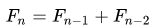
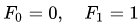

# Homework 02

The deadline of this homework is on **Monday, 26th of April, 00:00:00 UTC+2**.

This week's homework will test your grasp of some of the basic concepts of Python programming. You will have to solve three tasks involving concepts covered in the lecture. As always, you will pass the homework if the `pytest` passes both on your local system and online for all tasks. 

There are **three tasks** on which you will need to work, distributed across three files:

* `digsum.py`: Calculate the *digit sum* of a given `int`
* `fibonacci.py`: Calculate the *nth Fibonacci number*
* `findfib.py`: Find the *first Fibonacci number* whose *digit sum is larger than 42*

If you are using a conda environment, do not forget to activate it first by running `conda activate [ENVIRONMENT-NAME]` before testing your code.  

You can also test your implementation for each task separately using the commands `pytest test_digsum.py -vv`, `pytest test_fibonacci.py -vv` and `pytest test_findfib.py -vv` (the `-vv` flag will include some more information in the output of the test). In case you lose track which functions pass and which do not, use `pytest --tb=no -vv`. 

You are not allowed to import any libraries for this week's tasks, pure Python code should suffice. 

You can also have a look at the test files `test_digsum.py`, `test_fibonacci.py` and `test_findfib.py` if you are unsure about what has to be done. However, in some cases the test files intentionally contain obscuring techniques that ensure that you cannot just look in there for the solution. This is the case e.g. in `test_findfib.py`.
 
## Task 1 - Calculate the digit sum of an int

In the file `digsum.py`, write a function that for any given non-negative `int` returns its digit sum, so for e.g. 1234 it should return 10, since 1 + 2 + 3 + 4 = 10.  

**Hint:** You will need to convert between the data types `int` and `str` for this task.

## Task 2 - Calculate the nth Fibonacci number

In the file `fibonacci.py`, write a function that returns the nth *Fibonacci number*. If you do not know what a Fibonacci number is, you can look it up on [Wikipedia](https://en.wikipedia.org/wiki/Fibonacci_number).  

In short, the nth Fibonacci number is defined recursively as follows:  

With start values defined as:  

**Hint:** You do not necessarily have to implement this as a recursive function - a simple while-loop can be sufficient.

## Task 3 - Find a certain Fibonacci number

In the file `findfib.py`, write a function that determines the first Fibonacci number whose digit sum is larger than 42. For this, you may use the functions `digsum` and `fibonacci` that you defined earlier - they are already imported for your convenience.

